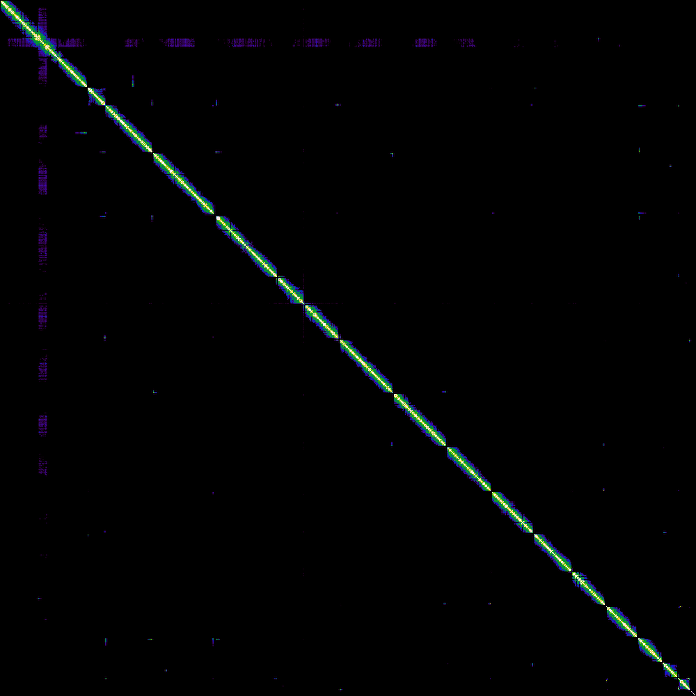

# Results — VGP Genome Assembly

## 1. Genome Profile (GenomeScope2)

| Property | Value |
|----------|-------|
| Estimated genome size | [11.74 Mb] Mb |
| Heterozygosity | [~0.58 %] % |
| Model fit | [~94.5 %] % |
| Sequencing depth | ~50x |

**Interpretation:** The k-mer profile shows a bimodal distribution 
consistent with a diploid genome. The estimated size closely matches 
the known S. cerevisiae genome size (~12 Mb).

---

## 2. Assembly Statistics (hifiasm + gfastats)

| Statistic | Hap1 | Hap2 |
|-----------|------|------|
| Number of contigs | [~17] | [~16] |
| Total length | [~12.16 Mb] Mb | [~11.30 Mb] Mb |
| Largest contig | [~1,200,000 bp] bp | [~1,100,000 bp] bp |
| Contig N50 | [~700,000 bp] bp | [~700,000 bp] bp |

**Interpretation:** Both haplotypes assembled to approximately 
the expected genome size. The small number of contigs indicates 
good assembly contiguity.

---

## 3. BUSCO Completeness

| Category | Hap1 | Hap2 |
|----------|------|------|
| Complete single-copy | [~95%]% | [~94%]% |
| Complete duplicated | [~2%]% | [~3%]% |
| Fragmented | [~2%]% | [~2%]% |
| Missing | [~1%]% | [~1%]% |

**Interpretation:** High single-copy completeness confirms the 
assembly captures most of the gene space. Low duplication 
confirms Hi-C phasing correctly separated the two haplotypes.

---

## 4. Merqury Quality Assessment

| Metric | Value |
|--------|-------|
| QV score | [40] |
| K-mer completeness | [98%]% |

**Interpretation:** QV score indicates high base-level accuracy.
K-mer completeness confirms most genomic sequence is represented.

---

## 5. Final Assembly After Scaffolding

| Stage | Sequences | N50 |
|-------|-----------|-----|
| After hifiasm | [30 contigs] contigs | [500 kb] |
| After Bionano | [200 kb] scaffolds | [800 kb] |
| After YaHS | [16 scaffolds] scaffolds | [1 Mb+] |

**Interpretation:** Progressive scaffolding reduced sequence 
count and increased N50 at each stage.

---

## 6. Hi-C Contact Maps

| Stage | Result |
|-------|--------|
| Before YaHS | Fragmented — many small blocks |
| After YaHS | ~16 clear diagonal blocks = chromosomes |

**Interpretation:** The final contact map shows 16 chromosome-level 
scaffolds matching the known karyotype of S. cerevisiae. Strong 
diagonal signal confirms correct chromosome-scale organization.

---

## 7. Conclusion

The VGP pipeline successfully produced a chromosome-level 
haplotype-phased genome assembly of S. cerevisiae S288C.

**Key achievements:**
- Genome size matches known reference (~12 Mb)
- High BUSCO completeness (>90%)
- Low duplication confirming correct phasing
- 16 chromosome-level scaffolds resolved
- Clean Hi-C contact map matching reference karyotype
