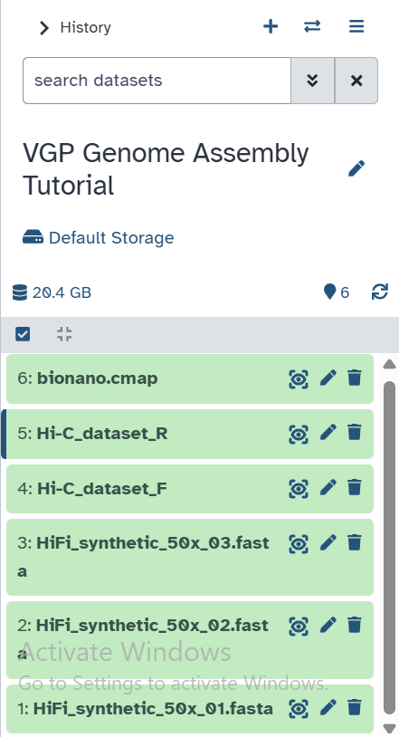

# Step 00 — Galaxy Setup

## Platform
- **Website:** usegalaxy.org
- **History name:** VGP Genome Assembly Tutorial

## Data Uploaded

| # | File | Format | Source |
|---|------|--------|--------|
| 1 | HiFi_synthetic_50x_01.fasta | fasta | Zenodo 6098306 |
| 2 | HiFi_synthetic_50x_02.fasta | fasta | Zenodo 6098306 |
| 3 | HiFi_synthetic_50x_03.fasta | fasta | Zenodo 6098306 |
| 4 | SRR7126301_1.fastq.gz | fastqsanger.gz | Zenodo 5550653 |
| 5 | SRR7126301_2.fastq.gz | fastqsanger.gz | Zenodo 5550653 |
| 6 | bionano.cmap | cmap | Zenodo 5887339 |

## Data Organization
- Hi-C file 1 renamed to `Hi-C_dataset_F` (forward reads)
- Hi-C file 2 renamed to `Hi-C_dataset_R` (reverse reads)
- 3 HiFi FASTA files grouped into a list collection named `HiFi_collection`

## Screenshot

