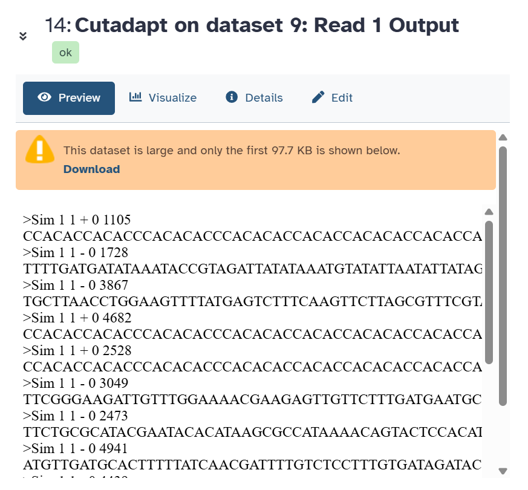
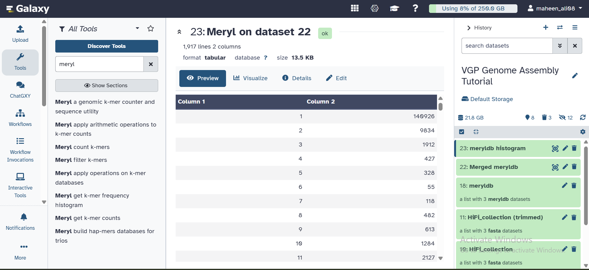

# Step 01 — HiFi Read Preprocessing

## Part A — Adapter Trimming (Cutadapt)

### What this step does
PacBio HiFi reads can contain adapter sequences anywhere inside 
the read. Reads containing adapters represent incorrectly joined 
DNA molecules and must be removed entirely before assembly.

### Tool
- **Name:** Cutadapt
- **Version:** 4.4+galaxy0
- **Input:** HiFi_collection (3 FASTA files)
- **Output:** HiFi_collection (trimmed)

### Parameters Used
| Parameter | Value | Reason |
|-----------|-------|--------|
| Read type | Single-end | HiFi reads are single-end |
| Adapter 1 | ATCTCTCTCAACAACAACAACGGAGGAGGAGGAAAAGAGAGAGAT | PacBio universal adapter |
| Adapter 2 | ATCTCTCTCTTTTCCTCCTCCTCCGTTGTTGTTGTTGAGAGAGAT | PacBio universal adapter |
| Max error rate | 0.1 | Allow 10% mismatch |
| Min overlap | 35 bp | Adapter must match 35+ bases |
| Search reverse complement | Yes | Check both strands |
| Discard trimmed reads | Yes | Remove entire read if adapter found |

## Cutadapt Output

Cutadapt was run on all 3 HiFi files as a collection.
Screenshot below shows the summary report from file 01
(reports for files 02 and 03 are similar).

---

## Part B — K-mer Counting (Meryl)

### What this step does
Meryl counts all 31-letter DNA substrings (k-mers) in the reads.
This frequency data is used by GenomeScope2 to estimate genome 
properties without needing a reference genome.

### Tool
- **Name:** Meryl
- **Version:** 1.3+galaxy6
- **Input:** HiFi_collection (trimmed)
- **Output:** meryldb histogram

### Three Runs Required

#### Run 1 — Count k-mers
| Parameter | Value |
|-----------|-------|
| Operation | Count canonical k-mers |
| Input | HiFi_collection (trimmed) |
| k-mer size | 31 |
| Output | meryldb (collection) |

#### Run 2 — Merge databases
| Parameter | Value |
|-----------|-------|
| Operation | Union-sum |
| Input | meryldb collection |
| Output | Merged meryldb |

#### Run 3 — Generate histogram
| Parameter | Value |
|-----------|-------|
| Operation | Generate histogram |
| Input | Merged meryldb |
| Output | meryldb histogram |

### Why k=31?
K-mer size 31 is long enough that most k-mers are unique in 
the genome, but short enough to tolerate sequencing errors.

### Screenshot

