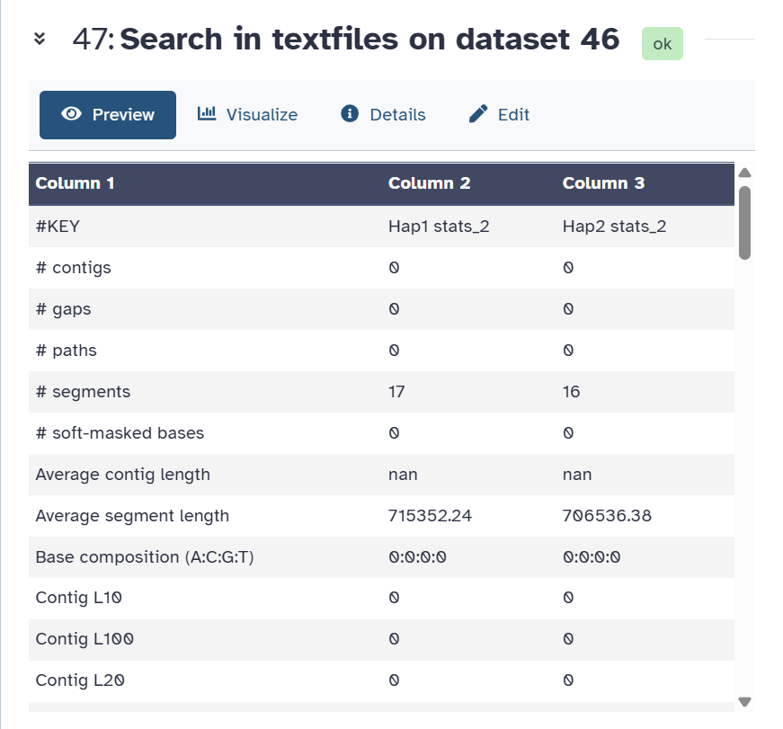

# Step 02 — Genome Profiling, Assembly and Statistics

## Part A — Genome Profiling (GenomeScope2)

### What this step does
GenomeScope2 fits a mathematical model to the k-mer frequency 
histogram to estimate genome size, heterozygosity, and repeat 
content without a reference genome.

### Tool
- **Name:** GenomeScope2
- **Version:** 2.0+galaxy2
- **Input:** meryldb histogram
- **Output:** Linear plot, log plot, summary, model parameters

### Parameters Used
| Parameter | Value |
|-----------|-------|
| Input histogram | meryldb histogram |
| Ploidy | 2 (diploid) |
| k-mer length | 31 |
| Output summary | Yes |

### Results
| Property | Value |
|----------|-------|
| Estimated genome size | [your value] Mb |
| Heterozygosity | [your value] % |
| Model fit | [your value] % |
| Diploid coverage | ~50x |

### Interpretation
The k-mer profile shows a bimodal distribution with:
- First peak at ~25x = heterozygous regions (one haplotype)
- Second peak at ~50x = homozygous regions (both haplotypes)
This is consistent with a diploid genome at 50x coverage.

### Screenshots

---

## Part B — Genome Assembly (hifiasm)

### What this step does
hifiasm assembles the genome from HiFi reads into contigs.
Using Hi-C data allows it to separate the two haplotypes 
(hap1 and hap2) — one from each parent chromosome copy.

### Tool
- **Name:** hifiasm
- **Version:** 0.19.8+galaxy0
- **Mode:** Hi-C phased
- **Input:** HiFi_collection (trimmed) + Hi-C_dataset_F + Hi-C_dataset_R
- **Output:** Hap1 contigs graph (GFA) + Hap2 contigs graph (GFA)

### Parameters Used
| Parameter | Value |
|-----------|-------|
| Assembly mode | Standard |
| Input reads | HiFi_collection (trimmed) |
| Hi-C R1 reads | Hi-C_dataset_F |
| Hi-C R2 reads | Hi-C_dataset_R |

### Why Hi-C phased mode?
Hi-C data shows which DNA regions are physically close in the 
nucleus. This allows hifiasm to correctly assign reads to each 
parental haplotype, reducing switch errors.

### Screenshot

---

## Part C — Assembly Statistics (gfastats)

### What this step does
gfastats converts GFA assembly graphs to FASTA format and 
calculates key assembly statistics like N50 and total length.

### Tool
- **Name:** gfastats
- **Version:** 1.3.6+galaxy0

### Run 1 — GFA to FASTA conversion
| Parameter | Value |
|-----------|-------|
| Input | Hap1 contigs graph + Hap2 contigs graph |
| Tool mode | Genome assembly manipulation |
| Output format | FASTA |
| Output | Hap1 contigs FASTA + Hap2 contigs FASTA |

### Run 2 — Assembly statistics
| Parameter | Value |
|-----------|-------|
| Input | Hap1 + Hap2 GFA files |
| Tool mode | Summary statistics generation |
| Expected genome size | 11747160 |
| Output | Statistics table |

### Assembly Statistics Results

| Statistic | Hap1 | Hap2 |
|-----------|------|------|
| Number of contigs | [your value] | [your value] |
| Total contig length | [your value] | [your value] |
| Largest contig | [your value] | [your value] |
| Contig N50 | [your value] | [your value] |
| GC content | [your value]% | [your value]% |

### Screenshot

