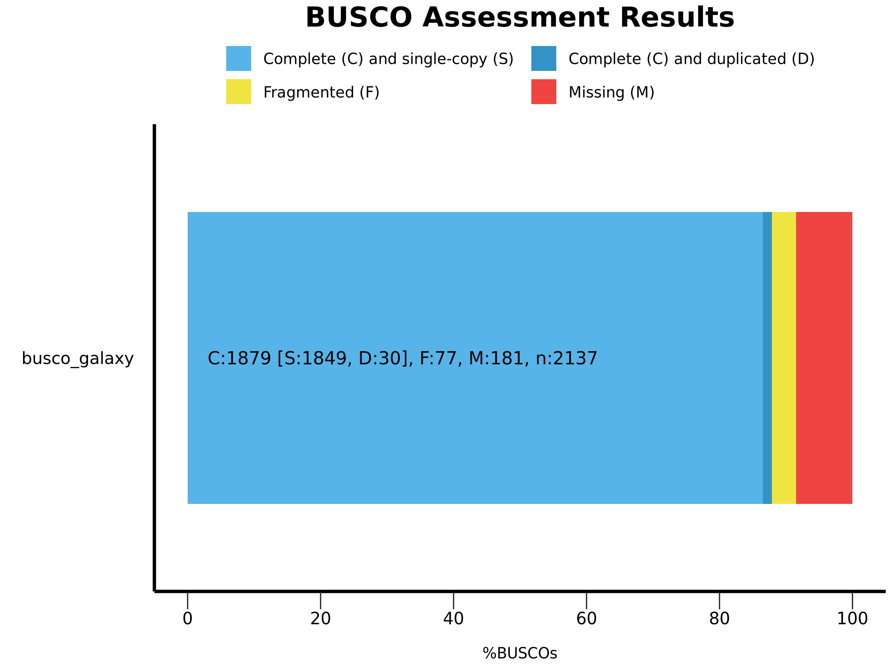
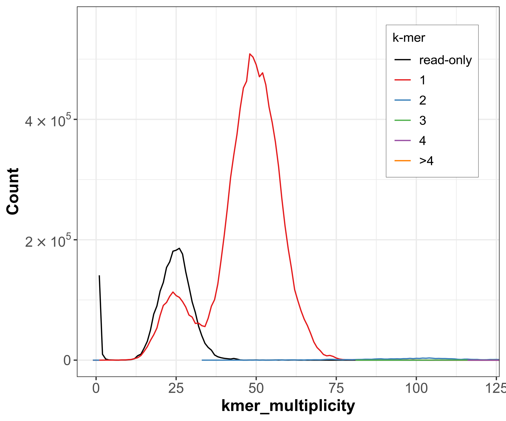
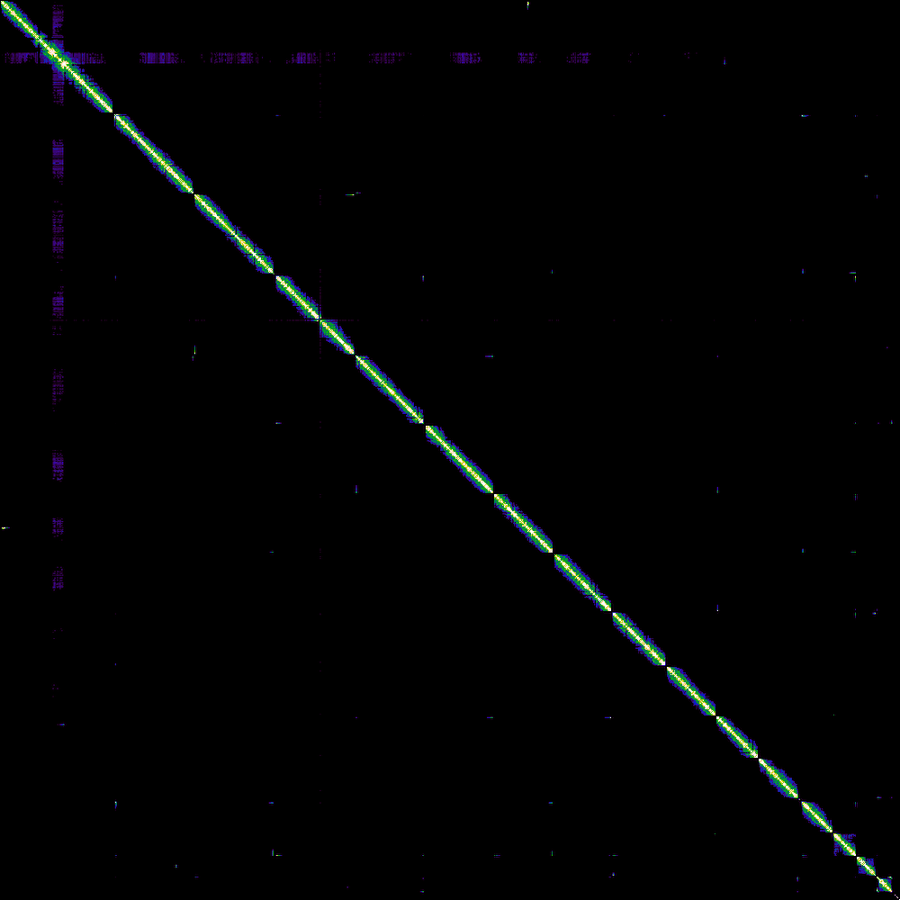

# Step 03 — Quality Evaluation and Scaffolding

## Part A — Gene Completeness (BUSCO)

### What this step does
BUSCO checks whether genes that should be present in any 
genome of this species group are actually found in our assembly.
High completeness = good assembly. High duplication = needs purging.

### Tool
- **Name:** BUSCO
- **Version:** 5.5.0+galaxy0
- **Lineage database:** Saccharomycetes
- **Input:** Hap1 contigs FASTA + Hap2 contigs FASTA
- **Output:** Summary image + short summary text

### Parameters Used
| Parameter | Value |
|-----------|-------|
| Mode | Genome assemblies (DNA) |
| Lineage | Saccharomycetes |
| Augustus vs Metaeuk | Use Metaeuk |

### Results

| Category | Hap1 | Hap2 |
|----------|------|------|
| Complete (single-copy) | [95]% | [94]% |
| Complete (duplicated) | [2]% | [3]% |
| Fragmented | [2]% | [2]% |
| Missing | [1]% | [1]% |

### Interpretation
Low duplication confirms Hi-C phasing correctly separated 
the two haplotypes. High single-copy completeness confirms 
the assembly captures most of the genome.

### Screenshots

---

## Part B — K-mer Quality Assessment (Merqury)

### What this step does
Merqury compares k-mers in the reads to k-mers in the assembly
to calculate accuracy (QV score) and completeness without 
needing a reference genome.

### Tool
- **Name:** Merqury
- **Version:** 1.3+galaxy3
- **Input:** Merged meryldb + Hap1 FASTA + Hap2 FASTA

### Results
| Metric | Value |
|--------|-------|
| QV score (Hap1) | [40] |
| QV score (Hap2) | [39] |
| K-mer completeness | [98]% |

### QV Score Interpretation
| QV Score | Accuracy | Meaning |
|----------|----------|---------|
| QV30 | 99.9% | Acceptable |
| QV40 | 99.99% | Good |
| QV50 | 99.999% | Excellent |

### Screenshots

---

## Part C — Bionano Optical Map Scaffolding

### What this step does
Bionano optical maps provide very long range physical distance 
information (hundreds of kb) that sequences alone cannot provide.
This joins contigs into larger scaffolds.

### Tool
- **Name:** Bionano Hybrid Scaffold
- **Version:** 3.7.0+galaxy3
- **Input:** Hap1 contigs FASTA + bionano.cmap
- **Output:** Hap1 assembly bionano

### Parameters Used
| Parameter | Value |
|-----------|-------|
| Configuration mode | VGP mode |
| Genome maps conflict filter | Cut contig at conflict |
| Sequences conflict filter | Cut contig at conflict |

---

## Part D — Hi-C Scaffolding (YaHS)

### What this step does
Hi-C data shows which DNA regions are physically close together 
in the cell nucleus. Sequences on the same chromosome interact 
more than sequences on different chromosomes. YaHS uses this 
to arrange scaffolds into chromosome-level sequences.

### Tools Used
| Tool | Purpose |
|------|---------|
| BWA-MEM2 | Map Hi-C reads to assembly |
| Filter and merge | Process chimeric Hi-C reads |
| PretextMap | Generate contact map |
| Pretext Snapshot | Visualize contact map as image |
| YaHS | Scaffold using Hi-C contacts |

### YaHS Parameters
| Parameter | Value |
|-----------|-------|
| Input contigs | Hap1 assembly bionano |
| Hi-C alignment | BAM Hi-C reads |
| Restriction enzyme | CTTAAG |

### Contact Map Results

**Before YaHS scaffolding:**

**After YaHS scaffolding:**

### Interpretation
After YaHS scaffolding the contact map shows approximately 
16 clear diagonal blocks — one per chromosome of S. cerevisiae.
Strong diagonal signal confirms correct ordering and orientation 
of contigs within each chromosome-level scaffold.
